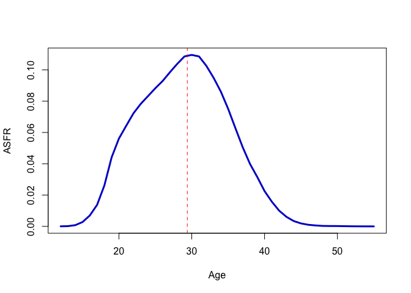

Animating Age-Specific Demographic Schedules
================

Age-Specfic Fertility
=====================

First, download the data from [the Human Fertility Database](https://www.humanfertility.org). You will need to register with a username and password. There is an `R` package, [HMDHFDplus](https://cran.r-project.org/web/packages/HMDHFDplus/index.html), that has utilities designed for use with these repositories, but I find it better pedagogically to go old-school when I'm doing this for a class. I also find the need to pass a username and password a bit awkward and find the benefit of a specialized package not outweighing the possible costs. So, download the data and make sure they're in the working directory (or use the path in your call to `read.table()`).

We need to clean the ages a bit since under-12 is indicated as `12-` and over-55 by `55+`. Note that we have to double-escape the `+` in the regular expression since the plus sign is a quantifier for regular expressions.

``` r
mab <- read.table("USAmabRR.txt", header=TRUE, skip=2)
asfr <- read.table("USAasfrRR.txt", header=TRUE, skip=2)
# clean ages
asfr$Age <- gsub("55\\+", "55", as.character(asfr$Age))
asfr$Age <- as.numeric(gsub("12-", "12", as.character(asfr$Age)))
# helpful for iterating; also always good to check
(yrs <- unique(asfr$Year))
```

    ##  [1] 1933 1934 1935 1936 1937 1938 1939 1940 1941 1942 1943 1944 1945 1946
    ## [15] 1947 1948 1949 1950 1951 1952 1953 1954 1955 1956 1957 1958 1959 1960
    ## [29] 1961 1962 1963 1964 1965 1966 1967 1968 1969 1970 1971 1972 1973 1974
    ## [43] 1975 1976 1977 1978 1979 1980 1981 1982 1983 1984 1985 1986 1987 1988
    ## [57] 1989 1990 1991 1992 1993 1994 1995 1996 1997 1998 1999 2000 2001 2002
    ## [71] 2003 2004 2005 2006 2007 2008 2009 2010 2011 2012 2013 2014 2015 2016
    ## [85] 2017

``` r
# for scaling y-axis
max(asfr$ASFR)
```

    ## [1] 0.26932

``` r
# give it a test
plot(asfr$Age[asfr$Year==2017], asfr$ASFR[asfr$Year==2017], 
     type="l",
     lwd=3,
     col="blue3",
     xlab="Age", ylab="ASFR")
abline(v=mab$MAB[85], lty=2, col="red")
```



Animation
---------

I use the `animate` package to create the gifs. Another option would have been `gganimate` which extends the `ggplot2` grammar of graphics to animated images, but I have more experience with `animate`, so that's what I went with. `animate` uses the [ImageMagick](http://www.imagemagick.org/script/index.php) library to create its animations, which may be a turn-off for some people since you need to install it separately. Fortunately, it's pretty straightforward to install using either [MacPorts](http://www.macports.org/) or [HomeBrew](https://brew.sh/).

Simply set up a `for` loop to generate the 85 ASFR curves within a `saveGIF()` command. I find that an interval of 0.3 seconds gives a pretty snappy but comprehensible animation. Anything much longer makes the animation seem ponderously slow. Any quicker and it's hard to relate the changing curves to the historical period.

``` r
library(animation)

saveGIF({ for(i in 1:85){
  plot(asfr$Age[asfr$Year==yrs[i]], asfr$ASFR[asfr$Year==yrs[i]], 
       type="l", 
       lwd=3,
       col="black",
       xlab="Age",
       ylab="ASFR",
       ylim=c(0,0.28))
  title(yrs[i])
  # mean age of childbearing
  abline(v=mab$MAB[i], lty=2, col="red")
}
  }, movie.name = "usa_asfr_1933-2017.gif", interval = 0.3)
```

    ## [1] TRUE

Unfortunately, the output doesn't display in a Markdown document, but we can insert it manually.


Central Death Rates
===================

I downloaded the annual life tables with one-year age groups from [the Human Mortality Database](http://www.mortality.org).

``` r
# 1x1 life tables for the USA, 1933-2017
mlts <- read.table("usa_mltper_1x1.txt", header=TRUE, skip=2)
flts <- read.table("usa_fltper_1x1.txt", header=TRUE, skip=2)
mlts$Age <- as.numeric(gsub("110\\+", "110", as.character(mlts$Age)))
flts$Age <- as.numeric(gsub("110\\+", "110", as.character(flts$Age)))
# female and male life expectancies at birth
fe0 <- flts$ex[flts$Age==0]
me0 <- mlts$ex[mlts$Age==0]
```

I plot the natural logarithm of the sex-specific central death rate *m*<sub>*x*</sub> against age. This particular visualization allows us to see eight salient features of the human mortality experience:

1.  Overall bathtub shape.
2.  Marked sex differences, with male mortality being higher than female mortality at nearly every age.
3.  An early peak in mortality, followed by a rapid decline.
4.  Minimum mortality rate at around age 10-11.
5.  Linear increase on a log-scale after about age 30.
6.  Male accident hump in late adolescence/early adulthood (particularly acute during WWII).
7.  Slight decline in the mortality rate among oldest old (note that HMD smooths the number in the open last age-class, so this should be viewed with caution).
8.  Accentuation in sex differences as mortality improves.

Again, use `animate` to generate the GIF animation of the evolution of the central death rate in the US. Add vertical lines to indicate life expectancy at birth for each year. The female curves are plotted in black and the male curves are plotted in grey.

``` r
saveGIF({
  for(i in 1:85){
    plot(flts$Age[flts$Year==yrs[i]], log(flts$mx[flts$Year==yrs[i]]), 
         type="l", 
         lwd=3,
         col="black",
         xlab="Age",
         ylab="log(Mx)",
         ylim=c(-9.5,0))
    lines(mlts$Age[mlts$Year==yrs[i]], log(mlts$mx[mlts$Year==yrs[i]]),
          lwd=3,
          col=grey(0.85))
    abline(v=fe0[i], lty=2, col="black")
    abline(v=me0[i], lty=2, col=grey(0.85))
    title(yrs[i])
  }
}, movie.name = "usa_mx_1933-2017.gif", interval = 0.3)
```

    ## Output at: usa_mx_1933-2017.gif

    ## [1] TRUE

Again, the output doesn't display in the Markdown document, but I've added a link to it.


